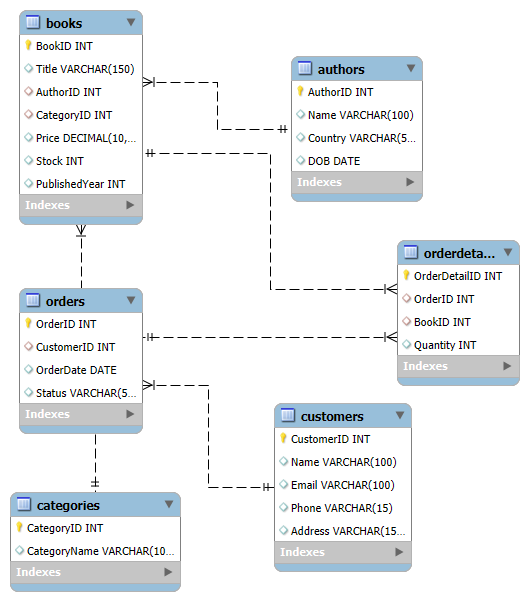

# 🛒 Online Bookstore Database

## Scenario
Database for managing books, authors, customers, and orders.

---

## Tables
- Authors
- Categories
- Books
- Customers
- Orders

---

## Features
- 25 SQL queries covering:
  - Filtering (WHERE)
  - Sorting (ORDER BY)
  - Aggregation (COUNT, SUM, AVG)
  - Joins
  - Subqueries

---

## ER Diagram

---

## 📄 SQL File [View SQL](schema_and_queries.sql)

---
