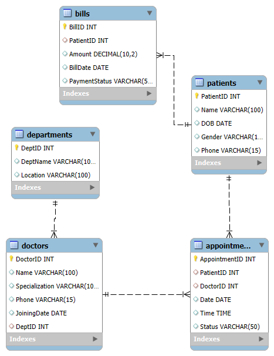

# 🏥 Hospital Management System

## Scenario
Database for managing doctors, patients, appointments, and billing.

---

## Tables
- Doctors
- Patients
- Appointments
- Departments
- Bills

---

## Features
- 25 SQL queries covering:
  - Patient analysis
  - Billing insights
  - Appointment tracking
  - Aggregations and joins

---

## ER Diagram

---

## SQL File [View SQL](schema_and_queries.sql)

---
