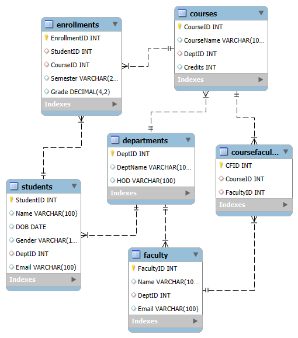

# 🎓 University Management System

## Scenario
Manage students, courses, faculty, and enrollments.

---

## Tables
- Students
- Departments
- Courses
- Faculty
- Enrollments

---

## Features
- Academic analytics
- Enrollment tracking
- Grade analysis
- SQL joins and aggregations

---

## ER Diagram

---

## SQL File [View SQL](schema_and_queries.sql)

---
