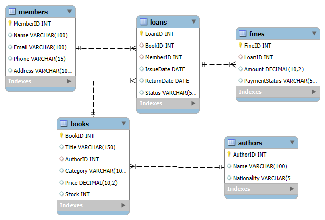

# 📚 Library Management System

## Scenario
Manage books, members, loans, and fines.

---

## Tables
- Books
- Authors
- Members
- Loans
- Fines

---

## Features
- Loan tracking
- Fine calculation
- Book analysis
- SQL queries with joins

---

## ER Diagram

---

## SQL File [View SQL](schema_and_queries.sql)

---
