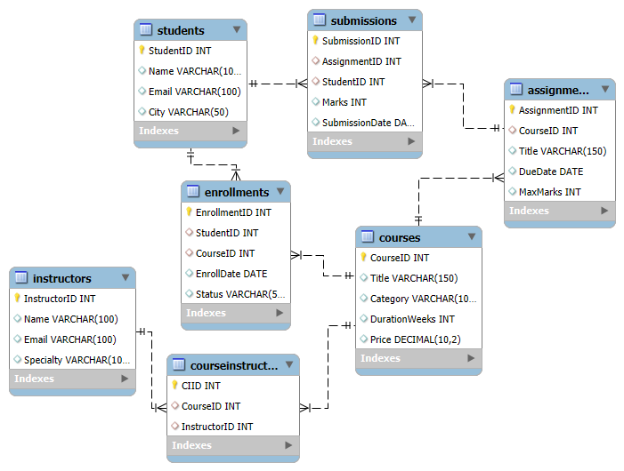

# 💻 E-Learning Platform

## Scenario
Manage courses, students, instructors, and enrollments.

---

## Tables
- Courses
- Instructors
- Students
- Enrollments
- Assignments

---

## Features
- Course analytics
- Student tracking
- Enrollment insights
- SQL queries with joins

---

## ER Diagram

---

## SQL File [View SQL](schema_and_queries.sql)

---
